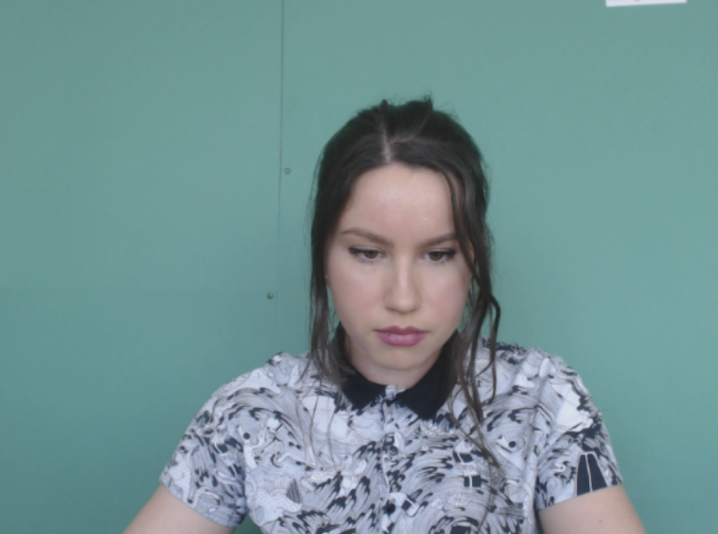
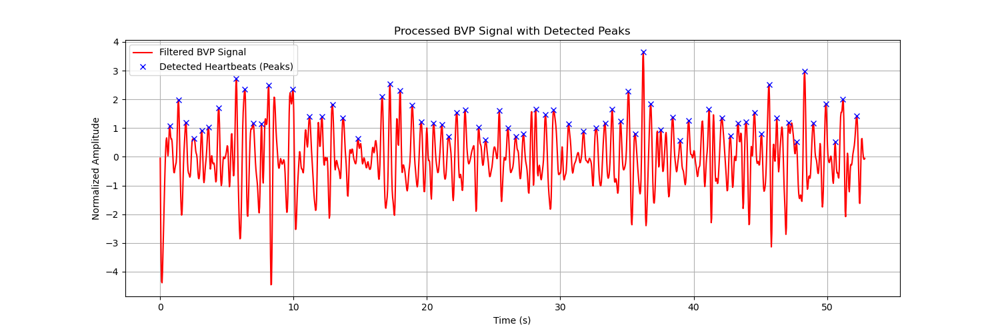
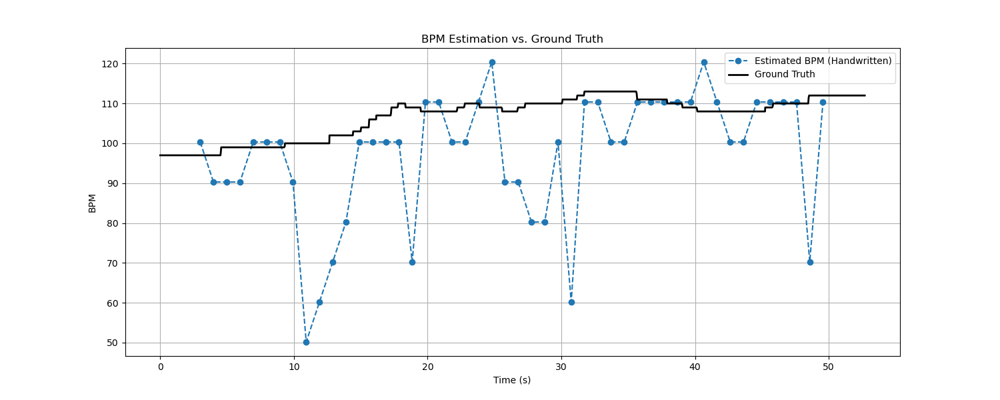
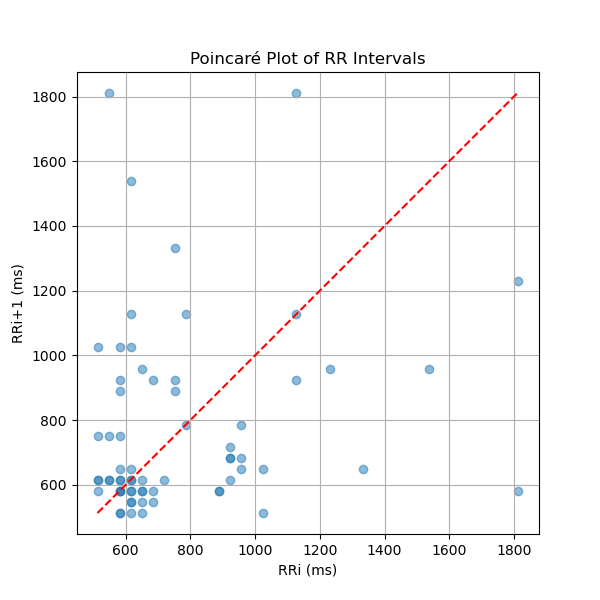

# rPPG-estimation

## 项目报告

本项目是远程光电容积描记法 (Remote Photoplethysmography, rPPG) 基础框架。能处理视频文件，从人脸特定区域提取血容量脉冲 (Blood Volume Pulse, BVP) 信号，并进一步计算出实时心率 (BPM)、RR间期以及心率变异性 (HRV) 等生理指标。

由于在实验初期遇到了算法库 (`pyVHR`) 的环境与版本冲突问题，demo_1初步采用了手动定义函数的方式，从零开始实现了信号提取和分析的核心流程。

项目使用了公开的 **UBFC-rPPG** 数据集进行算法验证，并与数据集提供的 `ground_truth` 进行了精度对比。

## 主要功能

* **人脸关键点检测**: 使用 `MediaPipe Face Mesh` 准确定位人脸额头区域作为ROI。
* **原始信号提取**: 通过分析ROI内像素（尤其是绿色通道）的平均亮度变化，提取原始的 rPPG (BVP) 信号。
* **信号处理**: 对原始信号进行去趋势、带通滤波 (0.7-4.0 Hz) 和归一化，以去除噪声并保留有效心跳频率。
* **心率 (BPM) 计算**: 采用滑动窗口和快速傅里叶变换 (FFT) 技术，计算随时间变化的动态心率。
* **心率变异性 (HRV) 分析**:
    * 通过峰值检测算法找到BVP信号中的心跳波峰。
    * 计算 RR 间期。
    * 分析时域HRV指标，如 RMSSD 和 SDNN。
* **结果评估与可视化**:
    * 将估算的心率与 `ground_truth` 进行对比，并计算 RMSE 和 MAE 等误差指标。

## 编译环境

* **编程语言**: Python 3.9
* **核心库**:
    * OpenCV: 视频文件读写。
    * MediaPipe: 人脸关键点检测。
    * SciPy: 信号滤波、峰值检测和FFT。
    * NumPy & Pandas: 数据处理与分析。
    * Matplotlib: 数据可视化。
* **数据集**: [UBFC-rPPG Dataset](https://sites.google.com/view/ubfcrppg)

## 结果
数据集视频源效果如下：

通过对 UBFC 数据集中的一个52秒视频进行分析，得到了以下结果。

### 1. BVP 信号处理与心跳检测
下图展示了经过滤波和归一化处理后的 BVP 信号，并标记了算法检测到的心跳峰值点。

### 2. 心率估算 vs. 真实值
将通过FFT估算出的BPM与 `ground_truth` 进行对比。结果显示，尽管存在一些受信号干扰导致的跳变，大部分预测值与真实值趋势重合。根据FFT功率谱分析和对比图，受试者心率在100-110 BPM之间，可能处于运动后的状态。

### 3. HRV 分析：庞加莱图
庞加莱图直观地反映了 RR 间期的分布情况。下图显示 RR 间期主要集中在 800-1000ms 区域，部分离散点可能由 rPPG 信号不稳定造成。

## 后续工作

本项目成功搭建了一个 rPPG 的基础研究框架。后续可以从以下方向进行扩展：
* 解决环境依赖问题，尝试集成 `pyVHR` 库并调用更先进的算法，如 **CHROM** 和 **POS**。
* 对算法进行优化，提高在不同光照和运动条件下的鲁棒性。
* 扩展功能，尝试从 rPPG 信号中提取呼吸率、血氧饱和度 (SpO2) 等更多生理指标。

## 许可 (License)
本项目采用 [MIT 许可证](LICENSE)。